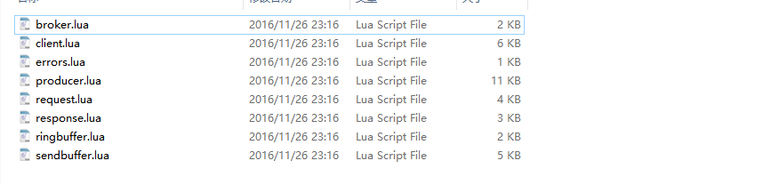
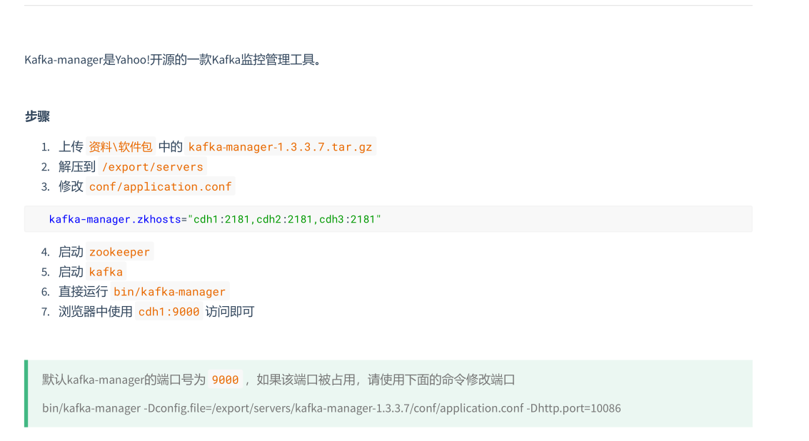
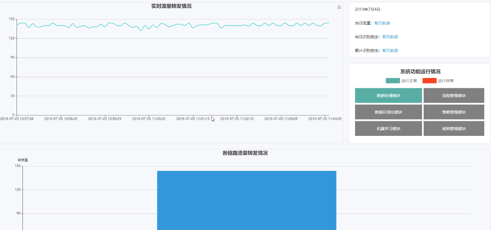

# 反爬系统

## 系统说明

```shell
#1. 开启zk:	kafka需要zk [三台都需要操作]
	/export/servers/zookeeper-3.4.5-cdh5.14.0/sbin/zkServer.sh start
	#查看状态
	/export/servers/zookeeper-3.4.5-cdh5.14.0/sbin/zkServer.sh status
#2. 开启kafka:	开启集群kafka
	#开启kafka [三台都需要操作]
	/export/servers/kafka/bin/kafka-server-start.sh  /export/servers/kafka/config/server.properties > /dev/null 2>&1 &
	#模拟消费者
	bin/kafka-console-consumer.sh -from-beginning -topic B2CDATA_COLLECTION1 -zookeeper node01:2181,node02:2181,node03:2181
	#查看已创建的topic列表
	bin/kafka-topics.sh --list --zookeeper node01:2181
#3. 集成 1.nginx与lua 2. openresy与redis 3. lua集成kafka:	开启nginx
	#开启nginx [node01]
	/usr/local/openresty/nginx/sbin/nginx 
#4. 集成redis集群:	开启redis集群
	#进入redis目录 [node01]
	/export/servers/redis
	分别启动7001 7002 7003
	bin/redis-server  cluster/7001/redis.conf 
	bin/redis-server  cluster/7002/redis.conf 
	bin/redis-server  cluster/7003/redis.conf 
#5. 开启hadoop集群(hdfs)
```


### 第一阶段

#### nginx集成lua

```
引入文件:
content_by_lua_file /usr/local/openresty/testlua/mynginx.lua;
```

完整nginx.conf文件(**多余的删除了**)

```lua
#user  nobody;
worker_processes  1;

#error_log  logs/error.log;
#error_log  logs/error.log  notice;
#error_log  logs/error.log  info;

#pid        logs/nginx.pid;


events {
    worker_connections  1024;
}


http {
    include       mime.types;
    default_type  application/octet-stream;

    #log_format  main  '$remote_addr - $remote_user [$time_local] "$request" '
    #                  '$status $body_bytes_sent "$http_referer" '
    #                  '"$http_user_agent" "$http_x_forwarded_for"';

    #access_log  logs/access.log  main;

    sendfile        on;
    #tcp_nopush     on;

    #keepalive_timeout  0;
    keepalive_timeout  65;

    #开启共享字典，设置内存大小为10M，供每个nginx的线程消费
    lua_shared_dict shared_data 10m;
    #配置本地域名解析
    resolver 127.0.0.1;

    #gzip  on;

    server {
        listen       80;
        server_name  localhost;

        charset utf-8;

        #access_log  logs/host.access.log  main;

        location / {
            #root   html;
            #index  index.html index.htm;
            
            default_type text/html;
            
            #content_by_lua_block{
            #   ngx.say("hello world");
            #}
            #开启nginx监控
            stub_status on;
            content_by_lua_file /usr/local/openresty/textlua/controller.lua;
        }

        #error_page  404              /404.html;

        # redirect server error pages to the static page /50x.html
        #
        error_page   500 502 503 504  /50x.html;
        location = /50x.html {
            root   html;
        }
    }
}
```


#### openresty集成redis

```
1：引入redis的模块：local redis = require("resty.redis")
2：创建redis实例：local red = redis:new()
3：创建redis连接：local  ok, err = red:connect("192.168.180.111", 6379)
4：发送消息：local ok, err = red:set("itcast", "itcast is heima")
```

配置的lua脚本文件代码

```lua
---需求：集成lua和kafka模块，将nginx的请求及请求参数写入到kafka的集群
---代码实现思路：
---1：初始化最大活跃连接数及kafka的相关参数
---2：获取写入kafka集群的相关参数并拼接成字符串
---3：导入kafka的依赖模块
---4：将拼接好的字符串发送到kafka集群
---设置最大活跃连接数为1000，作为保护机制
local maxUserNumber = 1000
---指定kafka集群地址
local broker_list = {
    { host = "192.168.83.110", port = 9092 },
    { host = "192.168.83.120", port = 9092 },
    { host = "192.168.83.130", port = 9092 }
}
---设置topic。将数据写到哪个topicKafkaTopic
local topic = "B2CDATA_COLLECTION01"
---自定义分区数量，该值一定要跟实际分区的数量保持
local partition_num = 3
---自定义分区器，因为默认的分区器不好用，传一个key，返回key，key就是我们的分区id
local function partitioner(key)
    return tonumber(key)
end
---设置生产者相关的配置参数
local producer_config = { request_timeout = 2000, partitioner = partitioner }

---共享内存变量使用
---定义一个共享内存的key
local polling_key = "POLLING_KEY"
---获取nginx的共享内存
local shared_data = ngx.shared.shared_data
---在共享内存中获取指定的key
local polling_value = shared_data:get(polling_key)
---如果在共享内存中没有获取到计数器的值，则给一个默认值
if not polling_value then
    polling_value = 0
    shared_data:set(polling_key, polling_value)
end
---将polling_value的值进行自增操作
shared_data:incr(polling_key, 1)

---根据计数器的值，推算出来这个值应该放到哪个分区  发送的数据需要是字符串形式的 所有拼接一个""
--- 计数器 % 分区数 = 分区数的id
local partitionid = "" .. (tonumber(polling_value) % partition_num)

---打印计数器的值
ngx.say("count：", polling_value)

--设置阈值，如果当前活跃连接数大于设置的最大活跃连接数，则不写入kafka数据
local isGone = true
--判断当前活跃连接数是否超过了阈值
if (tonumber(ngx.var.connections_active) > maxUserNumber) then
    isGone = false
end
---如果低于阈值的条件，才可以采集数据生产到kafka
if isGone then
    --访问时间
    local time_local = ngx.var.time_local
    if time_local == nil then
        time_local = ""
    end
    --请求的连接
    local request = ngx.var.request
    if request == nil then
        request = ""
    end
    --请求的方式
    local request_method = ngx.var.request_method
    if request_method == nil then
        request_method = ""
    end
    --content_type头信息
    local content_type = ngx.var.content_type
    if content_type == nil then
        content_type = ""
    end
    --读取body信息
    ngx.req.read_body()
    ---请求参数
    local request_body = ngx.var.request_body
    if request_body == nil then
        request_body = ""
    end
    ---跳转来源
    local http_referer = ngx.var.http_referer
    if http_referer == nil then
        http_referer = ""
    end
    ---客户端地址
    local remote_addr = ngx.var.remote_addr
    if remote_addr == nil then
        remote_addr = ""
    end
    --用户代理
    local http_user_agent = ngx.var.http_user_agent
    if http_user_agent == nil then
        http_user_agent = ""
    end
    --带时区的访问时间
    local time_iso8601 = ngx.var.time_iso8601
    if time_iso8601 == nil then
        time_iso8601 = ""
    end
    --服务器地址
    local server_addr = ngx.var.server_addr
    if server_addr == nil then
        server_addr = ""
    end
    --cookie信息
    local http_cookie = ngx.var.http_cookie
    if http_cookie == nil then
        http_cookie = ""
    end
    --封装数据
    local message = time_local .. "#CS#" .. request .. "#CS#" .. request_method .. "#CS#" .. content_type .. "#CS#" .. request_body .. "#CS#" .. http_referer .. "#CS#" .. remote_addr .. "#CS#" .. http_user_agent .. "#CS#" .. time_iso8601 .. "#CS#" .. server_addr .. "#CS#" .. http_cookie .. "#CS#" .. ngx.var.connections_active;
    --导入kafka的依赖包
    local producerPAC = require("resty.kafka.producer")
    --使用producer创建producer的实例
    local producer = producerPAC:new(broker_list, producer_config)
    --发送消息
    local ok, err = producer:send(topic, partitionid, message)
    --打印日志
    if not ok then
        ngx.log(ngx.ERR, "kafka send message err:", err)
    end
end

```

### 第二阶段

- lua集成kafka
- Kafkamanager的使用（主要是确认lua有没有将数据写入kafka）
- 实现kafka的数据读取
- 实现链路统计模块

#### lua集成kafka

1：将kafka集成包上传到openresty/lualib/kafka目录



2：配置nginx.conf

```
在http节点添加
	#开启共享字典，设置内存大小为10M，供每个nginx的线程消费
	lua_shared_dict shared_data 10m;
	#配置本地域名解析
	resolver 127.0.0.1;
	
在location节点添加
	#开启nginx监控
	stub_status on;
	#加载lua文件
	default_type text/html;
	content_by_lua_file /usr/local/openresty/nginx/conf/controller.lua;
```

3：代码实现

```
1：创建kafka的topic、brokerlist、parttition_num、producer_config
2：自定义分区
	在nginx中设置共享内存
	在lua的脚本中取出来共享内存，然后设置自己的polling_key和polling_value
	拿到count对partition_num进行取余，获取到分区id，确定分区
	将polling_value进行自增操作
3：判断活跃连接数
	拿到ngx的活跃连接数：ngx.var.connections_active
	拿到参数后跟最大活跃连接数做判断
	满足条件后收集数据到kafka集群
4：收集数据到kafka
	按照要求采集request的信息
	将采集到的的数据使用字符串进行拼接
	创建producer的生产者实例
	将数据写入到kafka集群
	记录错误日志
```

### kafka集成lua常见的问题

```
1：kafka的分区，脚本中定义的分区数量跟物理分区数量不一致
2：注释换行，一定要加注释
3：查看日志，kafka写入失败的原因
	no resolver defied to resolver
	这是因为我们的kafka配置的hostname，而不是ip地址，而nginx遇到hostname的时候，必须要通过dns解析，而不是依靠/etc/hosts来解析的，所以会报上面的错误，这里解决方式：
	listeners=PLAINTEXT://192.168.180.111:9092
	advertised.listeners=PLAINTEXT://192.168.180.111:9092		
```

#### kafka-manager的安装



### kafka消费数据的两种方式的区别

```
Kafka direct 跟receiver 方式接收数据的区别?

Receiver是使用Kafka的高层次Consumer API来实现的。
Receiver从Kafka中获取的数据都是存储在Spark Executor的内存中的，然后Spark Streaming启动的job会去处理那些数据。
然而，在默认的配置下，这种方式可能会因为底层的失败而丢失数据。
如果要启用高可靠机制，让数据零丢失，就必须启用Spark Streaming的预写日志机制（Write Ahead Log，WAL）。
该机制会同步地将接收到的Kafka数据写入分布式文件系统（比如HDFS）上的预写日志中。
所以，即使底层节点出现了失败，也可以使用预写日志中的数据进行恢复，但是效率会下降。

Direct这种方式会周期性地查询Kafka，来获得每个topic+partition的最新的offset，从而定义每个batch的offset的范围。
当处理数据的job启动时，就会使用Kafka的简单consumer api来获取Kafka指定offset范围的数据。

这种方式有如下优点：

1、简化并行读取：
如果要读取多个partition，不需要创建多个输入DStream然后对它们进行union操作。
Spark会创建跟Kafka partition一样多的RDD partition，并且会并行从Kafka中读取数据。所以在Kafka partition和RDD partition之间，有一个一对一的映射关系。


2、高性能：
如果要保证零数据丢失，在基于receiver的方式中，需要开启WAL机制。
这种方式其实效率低下，因为数据实际上被复制了两份，Kafka自己本身就有高可靠的机制，会对数据复制一份，而这里又会复制一份到WAL中。
而基于direct的方式，不依赖Receiver，不需要开启WAL机制，只要Kafka中作了数据的复制，那么就可以通过Kafka的副本进行恢复。

3、一次且仅一次的事务机制：
基于receiver的方式，是使用Kafka的高阶API来在ZooKeeper中保存消费过的offset的。
这是消费Kafka数据的传统方式。
这种方式配合着WAL机制可以保证数据零丢失的高可靠性，但是却无法保证数据被处理一次且仅一次，可能会处理两次。
因为Spark和ZooKeeper之间可能是不同步的。
基于direct的方式，使用kafka的简单api，SparkStreaming自己就负责追踪消费的offset，并保存在checkpoint中。
Spark自己一定是同步的，因此可以保证数据是消费一次且仅消费一次。
```

#### dataprocess数据处理

```
1: 创建项目
2: 引入pom文件
3: 引入工具类、bean、枚举类
4: 写dataprocess的预处理数据驱动类(DataProcessLuncher) 设置StreamingContext的业务处理
	4.1 定义优雅停止
	4.2 创建conf和ssc
	4.3 读取kafka参数 设置StreamingConetxt的业务处理
5: 创建SetSsc方法实现具体的业务逻辑
	5.1 创建StreamingContext对象
	5.2 创建kafka的DirectStream
	5.3 打印消息(数据拆分后的消息)
	5.4 返回ssc
6: 流量统计的需求
	6.1 获取各个链路的访问量
	6.2 获取最新最大的活跃连接数
	6.3 将访问量和活跃连接数写入到redis数据库中
```

### 第三阶段

- 数据清洗模块
- 数据脱敏模块
- 数据分类打标签模块

#### 数据拆分

将字符串拆分成Bean对象, 拆分的目的是方便后续的开发,不需要每次都进行拆分

#### 数据清洗

需求分析

```
数据从kafka中读取过来以后, 已经使用了#CS#进行了拆分
数据清洗的规则在数据库中动态配置
读取到数据库中的规则进行广播到executor节点, 可以让所以的executor节点都能访问到
设置数据的的更新标记（“FilterRuleChangeFlag”）记录到redis中, 判断需不需要过滤规则
读取到过滤规则后, 在程序中拿到request请求地址信息, 跟广播变量中的规则进行判断
```

代码实现步骤

```
1. 定义一个工具类QueryDB, 用来查询数据库中某个表的某个字段
2. 通过AnalyzerRuleDB.queryFilterRule查询数据库中xx_filter_rule的过滤规则
3. 将查询到的规则进行广播
4. 定义urlFilter对象，进行url的正则表达式匹配
```

#### 数据脱敏

需求分析

```
1. 数据采集过来以后, cookie中包含手机号码和身份证号码,对这些敏感信息进行加密处理,避免明文暴露
2. 将手机号身份证号码等等进行正则匹配
3. 使用MD5算法将用户的手机号身份证号码进行加密
```

代码实现步骤

```properties
1. 定义MD5加密工具类
2. 定义正则表达式
3. 匹配字符串中的手机号和身份证号码
4. 找到手机号(身份证号码)的前一位和后一位, 进行是否数字判断
5. 如果是数字就不替换, 否则替换
6. 注意特殊: 如果手机号位于整个value值字符串的末尾, 那么只需要判断前一个字符即可
根据字符串替换的开始位置和结束位置进行替换, 字符串替换完成后,需要重新更新匹配规则
```

#### 数据分类

需求分析

1. 拿到脱敏后的数据进行处理
2. 拿到request这个字段进行分类判断, 判断出属于那种类型
3. 当判断类型以后,进行数据打标签

代码实现

1. 读取数据库配置的分类规则信息(国内国际 查询预定), 因为每类规则可能配置了多条url的正则表达式, 所以需要保存在数组中

   ​	查询的表: xx_classify_rule
   ​	将规则放到广播变量中
   ​	设置redis的更新标记: Classify
   
2. 分类打标签

​	加载广播变量中的规则数据
​	监视广播变量数据是否发生了变更
​	拿到request, 进行规则匹配, 匹配上了就打标签
​	​	将标签返回
​	
3. 单程往返打标签
    ​    拿到httpreferer中的数据进行切割
    ​	拿到切割后的kv数据, 判断kv是否是日期格式
    ​	循环匹配日期格式,匹配上一个就+1
    ​	判断匹配的日期数量, 匹配上两个日期就是往返, 匹配上一个日期就是单词, 否则其他
    ​	将标签返回

#### 数据解析

通过解析规则对数据进行解析，解析的时候有很多种格式，如get提交、post提交、提交的是form表单、提交的是json数据、提交的是xml数据等，我们需要针对不同的数据格式制定解析规则，但在此业务中，我们只需要着重关注解析json格式的数据。

1. 将kafka中读取到的数据进行分类, 往返打标签, 判断数据是国内还是国际, 查询还是预定

2. 将解析规则进行广播到executor节点, 并设置redis 的标识

   解析数据:

3. 根据behavorType、method、requestMatchExpression, 去匹配上某一条解析规则

4. 根据解析规则就知道属于那种类型的数据, 然后进行数据的解析读取

5. 将解析完成的数据(Bean)返回

### 第四阶段

#### 数据加工

需求分析

1. 在后续的数据的计算结果中,会统计ip的黑名单数据放到redis中, 并且同步到mysql
2. 在数据处理的时候如果出现了历史的黑名单ip需要进行标记, 标记出高频ip
3. 所以, 首先读取黑名单ip数据,加载到广播变量
4. 通过redis标记进行黑名单数据的实时更新
5. 通过一条数据的ip和黑名单ip进行比较, 匹配上了就打标签(高频ip)

代码实现

1. 从数据库中读取黑名单列表xx_ip_blacklist, 并广播到executor节点,
2. 设置redis标记, 决定是否重新广播
3. 拿到remoteaddr(客户端服务器ip)和广播变量的黑名单ip列表, 进行ip地址匹配, 匹配上就是黑名单IP

#### 数据结构化

需求分析

1. 数据处理的所有过程完成以后, 要将数据结构化到kafka中
2. 选择后续实时计算任务进行处理所需要的字段返回
3. 将日期和集合都转换成字符串
4. 将所有的数据封装到ProcessData中

代码实现:

1. 解析核心参数(飞行时间, 始发地, 目的地), 封装到CireRequestParams对象中
2. 定义去空方法和toKafkaString方法
3. 在toKafkaString方法中, 先将Bean对象转换成Json字符串, 然后使用#CS#将字符串进行拼接
4. 返回拼接好的字符串 

#### 数据推送

需求分析

1. 数据通过Streaming程序进行清洗 分类 解析 加工 结构化等等操作以后, 返回了一个processedData对象
2. 根据操作类型BehavorType判断属于那种操作(查询, 预定)
3. 将不同的操作(查询, 预定) 推送到不同的topic中

代码实现

1. 首先通过Behavortype过滤出来属于query还是book
2. 拿到kafka的相关参数(topic和其他)
3. 分区生产

#### 任务实时监控

需求分析

1. 通过任务监控知道实时数据采集量计算时间

2. 首先打开sparkStreaming的配置项

   打开监控的参数.set("spark.metrics.conf.executor.source.jvm.class", "org.apache.spark.metrics.source.JvmSource")) 
   http://localhost:4040/streaming/ or http://localhost:4040/metrics/json/
3. 获取监控的json数据，获取gauges节点下的任务的开始时间和结束时间
4. 获取批次的计算量
5. 用计算量除以计算时间就是平均计算速度
6. 然后将计算结果封装到map中，发送到redis

代码实现
1. 通过sc获取监控url的节点信息(开始时间和结束时间)
2. 通过rdd获取批处理数据的总量
3. 通过时间和数据量计算出来平均计算的速度
4. 将所有的计算结果封装到map中
5. 将Map发送到redis中, 发送两种key(实时数据, 最新数据)
6. 前端通过读取redis, 进行数据的展示



7. web端通过读取redis数据进行展示

   ```
   	前台逻辑
   		通过index.jsp加载index.js文件
   		在index.js中加载commonIndex.jsp，并且通过commonIndex.jsp加载commonIndex.js文件
   		在commonindex.js中加载systemMonitorIndex.jsp，然后加载systemMonitorIndex.js
   		在systemMonitorIndex.js里面初始化首页的四个报表
   	
   	后台逻辑
   	系统功能运行情况
   		首先加载后台IndexSystemMonitorController中的getSystemFunctionInfo方法
   		在方法中加载redis数据，如果两分钟内有数据就返回sign=0， 如果两分钟内没有数据sign=1
		在前端通过sign去改变监控模块的颜色
	实时流量转发情况（60s刷新一次）
   		首页加载后台getRealTimeTraffic方法
   		在方法中加载redis数据，20分钟前的数据，endtime作为图标的x轴，sourcecount作为图表的y轴，将x轴数据和y轴数据封装到list集合中，将集合进行返回
   		获取集合中的x轴和y轴数据进行图表渲染展示
   	各链路流量转发情况
   		首先加载后台的IndexSystemMonitorController中的getRealTimeLinkTraffic方法
   		在方法中加载前20分钟的数据，然后获取最新的一条数据
   		将数据封装到map中返回，x轴就是ip地址，y轴就是链路数据量
   		最后页面通过柱状图展示
   	数据定时任务备份
   		通过定时任务每隔两个小时进行备份
   		从redis中查询出来30分钟之前的数据（redis数据），然后逐条将数据写入到mysql数据库中，并且插入一条mysql数据就删除0一条redis的数据
   ```

### 第五阶段
#### 实时计算

需求分析

1. 从kafka中读取dataprocess处理后的结构化数据
2. 将结构化数据分隔, 进行封装
3. 加载实时计算的数据库规则, 同步到广播变量, 并且通过redis设置更新
4. 根据规则进行每一个指标的计算
5. 将计算后的指标封装, 进行打分
6. 根据打分规则进行打分, 将符合分数阈值的数据过滤处理, 写到黑名单
7. 数据同步, 数据备份

代码实现:

1. 读取kafka数据

      编写一个驱动类, 包含kafka信息和zk信息
      读取kafka数据, 自己维护offset
2. 分隔数据并封装
      拿到kafka的数据进行分区操作
      分区后拿到一条数据进行分隔, 用分隔符#CS#
      分割处理的数据封装到ProcessedData
3. 数据库规则加载
      关键页面
      ip黑名单
      流程 策略 规则表

### 第六阶段(未完成)

根据已经算出的八项指标结果，进行爬虫识别、剔除非爬虫数据、写入redis，写入HDFS,redis数据恢复等

### 第七阶段(未完成)

爬虫分析性能的计算与监控、离线指标分析